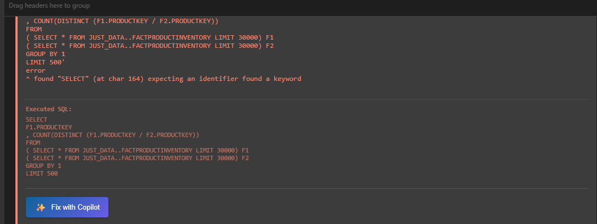
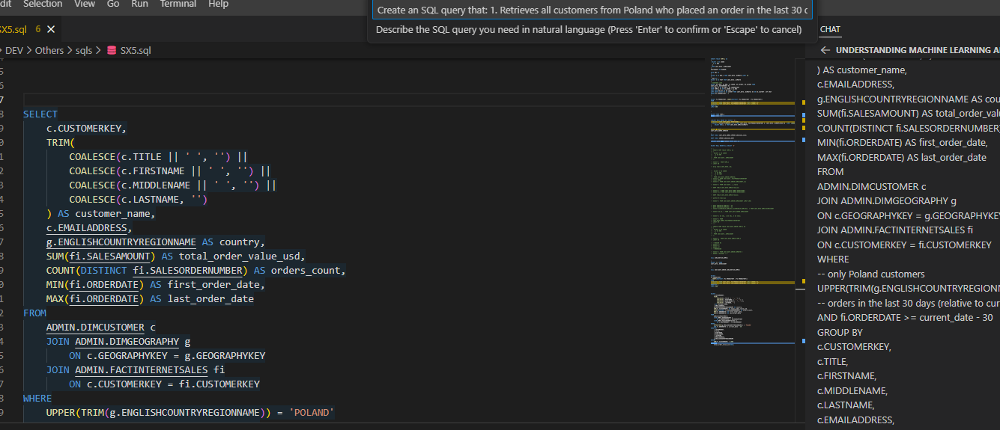

 # Copilot SQL Assistant
 
 ## ⚠️ Privacy & Data Security
 
 ### Important Notice
 
 **All AI features in this extension use GitHub Copilot, which transmits data to external Microsoft/GitHub servers for processing.**
 
 Before using any AI feature, please ensure:
 
 1. **Your SQL code** does not contain sensitive business logic or confidential algorithms
 2. **Table schemas** do not reveal confidential data structures or business-critical designs
 3. **Sample data** does not contain PII (Personally Identifiable Information) or sensitive information
 4. **Query history** does not include queries on sensitive tables
 
 ### Privacy Confirmation Dialog
 
 A **modal confirmation dialog** appears before sending data to AI for all major features:
 
 - **Fix SQL** - Shows summary of data to be transmitted
 - **Optimize SQL** - Shows summary of data to be transmitted
 - **Explain SQL** - Shows summary of data to be transmitted
 - **Generate SQL** - Shows summary of data to be transmitted
 - **Describe Data** - Shows detailed privacy notice with row/column count
 
 You can skip future confirmations by selecting **"Don't ask again"** or by enabling the setting:
 `justybase.copilot.skipPrivacyConfirmation`
 
 ### Data Transmission Summary
 
 | Feature | Data Sent | Destination |
 |---------|-----------|-------------|
 | Fix SQL | SQL code + Table DDL + Variables + Query history | GitHub Copilot (Microsoft) |
 | Optimize SQL | SQL code + Table DDL + Variables + Query history | GitHub Copilot (Microsoft) |
 | Explain SQL | SQL code + Table DDL + Variables + Query history | GitHub Copilot (Microsoft) |
 | Generate SQL | Database schema overview (tables, columns, types) | GitHub Copilot (Microsoft) |
 | Describe Data | Query results (up to 50 rows) | GitHub Copilot (Microsoft) |
 | AI Tools (#toolName) | Depends on tool (DDL, sample data, query results) | GitHub Copilot (Microsoft) |
 
 ### Corporate Environment Considerations
 
 If you are working in a corporate environment:
 
 - ✅ Check your company's AI/data policy before using these features
 - ✅ Consider using the "Don't ask again" option only on approved workstations
 - ✅ Contact your IT security team if unsure about data classification
 - ⚠️ Be aware that query history may contain sensitive table names
 
 ---
 
 ## Overview
 
 The **Copilot SQL Assistant** integrates GitHub Copilot directly into your SQL editing workflow with **full database context**. Instead of manually copying table schemas or variable information, the extension automatically gathers and sends:
 
 - ✅ Selected SQL code
 - ✅ Referenced table DDL (CREATE TABLE statements)
 - ✅ Workspace curated table profiles (user notes + selected table DDL)
 - ✅ Query variables and parameters
 - ✅ Active database connection info
 - ✅ Recent query context
 
 This allows Copilot to provide **highly accurate** suggestions, optimizations, and explanations tailored to your specific Netezza schema.
 
 ---
 
 ## Integration Methods

The extension provides **three ways** to interact with Copilot:

| Method | How to Use | Best For |
|--------|------------|----------|
| **Context Menu Commands** | Right-click → Copilot actions | Quick fixes, optimization |
| **Chat Participant** | Type `@sql-copilot` in Copilot Chat | Interactive conversations |
| **Language Model Tools** | Use `#toolName` in any chat | AI agent automation |

---

## Chat Participant: @sql-copilot ⭐ NEW

The `@sql-copilot` chat participant allows interactive conversations with full database context directly in Copilot Chat.

### Usage

Open Copilot Chat (`Ctrl+Shift+I`) and type:

```
@sql-copilot How can I optimize this query?
```

### Available Commands

| Command | Description | Example |
|---------|-------------|---------|
| `/schema` | Get DDL for tables in current SQL | `@sql-copilot /schema` |
| `/optimize` | Optimize SQL with Netezza best practices | `@sql-copilot /optimize reduce JOIN costs` |
| `/fix` | Fix SQL syntax errors | `@sql-copilot /fix column not found error` |
| `/explain` | Explain what the SQL does | `@sql-copilot /explain` |
| `/best-practices` | Rewrite SQL to follow Netezza best practices | `@sql-copilot /best-practices` |

### Examples

```
@sql-copilot /schema
→ Returns CREATE TABLE statements for all tables referenced in your current SQL file

@sql-copilot /optimize I need to reduce query time from 5 minutes
→ Analyzes your SQL and suggests Netezza-specific optimizations

@sql-copilot /fix ERROR: column "custmer_id" does not exist
→ Fixes typos and syntax issues based on actual table schema

@sql-copilot What's the best distribution key for this table?
→ General question with full schema context
```

---

## Language Model Tools ⭐ NEW

Language Model Tools allow Copilot to **automatically query your database** when working in agent mode. You can also reference them directly using `#toolName` syntax.

### Available Tools

| Tool | Reference | Description |
|------|-----------|-------------|
| **Get Schema** | `#schema` | Get DDL for tables in current SQL |
| **Get Columns** | `#getColumns` | Get column definitions for specific tables |
| **Get Tables** | `#getTables` | List all tables in a database |
| **Execute Query** | `#executeQuery` | Run SELECT queries (read-only) |
| **Sample Data** | `#sampleData` | Get sample rows from a table |
| **Explain Plan** | `#explainPlan` | Get semantic execution-plan analysis (graph + hotspots) |
| **Search Schema** | `#searchSchema` | Find tables/columns by pattern |
| **Table Stats** | `#tableStats` | Get row count, skew, distribution info |
| **Dependencies** | `#dependencies` | Best-effort dependency lookup (may be partial) |
| **Workspace Profiles** | `#workspaceProfiles` | List workspace-curated Copilot table profiles |
| **Validate SQL (Parser)** | `#validateSqlParser` | Parser/linter validation without executing |
| **Validate SQL (Database)** | `#validateSqlOnDatabase` | Validate with EXPLAIN dry-run + semantic hotspot summary |
| **Get SQL Diagnostics** | `#getSqlDiagnostics` | Read current SQL diagnostics with SQL/NZ/NZP codes |
| **Inspect Import File** | `#inspectImportFile` | Inspect file and infer delimiter, types, sample rows |
| **Propose Import Mapping** | `#proposeImportMapping` | Propose source→target mapping and CREATE SQL |
| **Execute Import** | `#executeImport` | Run import dry-run or execute import with audit |
| **Export Query Results** | `#exportQueryResults` | Export query output to CSV/XLSX/XLSB |
| **Get DDL** | `#getDDL` | Get DDL (CREATE statement) for a specific table, view, procedure, external table, or synonym by name |
| **Get Databases** | `#getDatabases` | List all accessible databases |
| **Get Schemas** | `#getSchemas` | List schemas in a database |
| **Get Views** | `#getViews` | List views in a database |
| **Get Procedures** | `#getProcedures` | List stored procedures |
| **Get External Tables** | `#getExternalTables` | List external tables with DATAOBJECT info |
| **Tuning Advisor** | `#getTuningAdvice` | Generate tuning recommendations from EXPLAIN + stats |

### Usage Examples

#### In Copilot Chat:

```
Show me sample data from CUSTOMERS table
#sampleData

What columns are in the ORDERS table?
#getColumns

Find all tables with "SALES" in the name
#searchSchema

Is this query valid? SELECT * FROM CUSTOMERS WHERE ID = 1
#validateSqlParser

Validate this query on database runtime
#validateSqlOnDatabase

Show current SQL diagnostics with issue codes
#getSqlDiagnostics

Inspect this file before import:
#inspectImportFile

Propose mapping from file to table:
#proposeImportMapping

Run import dry-run first:
#executeImport

Export this query as XLSX:
#exportQueryResults

How is data distributed in FACT_SALES?
#tableStats

Show me the DDL for DIMEMPLOYEE table
#getDDL

Get the CREATE statement for ADMIN.MYTABLE
#getDDL
```

#### Agent Mode (Automatic):

When using Copilot in **agent mode**, it can automatically invoke these tools to gather context. For example:

> "Analyze the SALES_FACT table and suggest optimizations"

Copilot will automatically:
1. Use `#tableStats` to check row count and skew
2. Use `#schema` to get table structure
3. Use `#explainPlan` on sample queries
4. Provide informed recommendations

The agent uses bounded multi-round orchestration (round and tool-call budgets) and standard tool envelopes (`summary/data/errors/next-actions`) to improve reliability.

### Tool Details

#### #executeQuery
Executes SELECT queries safely (read-only):
```
@sql-copilot Run this query and show results:
SELECT COUNT(*), STATUS FROM ORDERS GROUP BY STATUS
#executeQuery
```
- ⚠️ Only SELECT/WITH queries allowed
- ⚠️ INSERT/UPDATE/DELETE/DROP blocked for safety
- ⚠️ Results limited to 100 rows by default

#### #sampleData
Get sample rows to understand data patterns:
```
@sql-copilot Show me 20 sample rows from CUSTOMERS
#sampleData
```

#### #explainPlan
Analyze query performance:
```
@sql-copilot Explain the execution plan for:
SELECT * FROM ORDERS o JOIN CUSTOMERS c ON o.CUST_ID = c.ID
#explainPlan
```
Returns structured output (`summary/data/errors/next-actions`) including:
- semantic plan summary (node/edge counts, cost/confidence/risk),
- hotspot classification (`data_movement`, `full_scan`, `nested_loop`, `high_cost`, `low_confidence`),
- plan graph payload (`graph.nodes` / `graph.edges`) and recommended next actions.

#### #searchSchema
Find objects by pattern (supports % wildcard):
```
@sql-copilot Find all tables with CUSTOMER in the name
#searchSchema
```

#### #tableStats
Comprehensive table statistics:
```
@sql-copilot Check data skew on FACT_SALES
#tableStats
```
Returns: row count, pages, distribution key, SPU distribution, skew percentage.

#### #dependencies
Impact analysis before changes:
```
@sql-copilot What views depend on CUSTOMERS table?
#dependencies
```

**Parameters:**
- `objectName` (required): Object to analyze. Supports formats:
  - `TABLE` — simple name
  - `SCHEMA.TABLE` — schema-qualified
  - `DATABASE..TABLE` — database with default schema
  - `DATABASE.SCHEMA.TABLE` — fully qualified
- `objectType` (optional): `TABLE`, `VIEW`, or `PROCEDURE`
- `database` (optional): Explicit database scope

**Example invocations:**
```
#dependencies
objectName: "ORDERS"

#dependencies
objectName: "CUSTOMERS"
objectType: "TABLE"

#dependencies
objectName: "SALES..MY_VIEW"
objectType: "VIEW"
```

**Returns:** Structured output (`summary/data/errors/next-actions`) with:
- `graph.nodes` / `graph.edges` — dependency graph for visualization
- `dependencies[]` — each with `relationship`, `evidence`, `confidence`, `source`
- `counts.byType` — breakdown by object type

**Detection methods:**
- `FOREIGN_KEY` — from `_V_RELATION_KEYDATA` (high confidence)
- `VIEW_SQL_REFERENCE` — from `VIEW.DEFINITION` text scan (medium confidence)
- `PROCEDURE_SQL_REFERENCE` — from `PROCEDURESOURCE` text scan (medium confidence)

Results can be partial in restricted metadata scenarios.

#### #validateSqlParser
Parser/linter validation without execution:
```
@sql-copilot Is this SQL valid?
SELECT * FROM CUSTMOERS WHERE ID = 1
#validateSqlParser
```
Returns detailed error with suggestions.

#### #validateSqlOnDatabase
Database runtime validation using EXPLAIN:
```
@sql-copilot Validate this on database runtime:
SELECT * FROM CUSTOMERS WHERE ID = 1
#validateSqlOnDatabase
```
Requires active connection and returns a structured validation report:
- validates only the first statement (if multiple are provided, report includes explicit warning),
- includes EXPLAIN SQL, statement metadata, semantic plan summary, hotspots, and plan graph,
- emits actionable next steps when EXPLAIN fails or detects high-risk operators.

#### #getSqlDiagnostics
Read active SQL diagnostics with issue codes:
```
@sql-copilot Show SQL diagnostics for current file
#getSqlDiagnostics
```
Returns diagnostics with codes such as `SQLxxx`, `NZxxx`, `NZPxxx`.

#### #workspaceProfiles
List workspace-curated table profiles (with user notes) and optionally mark a profile for one-time inclusion in the next Copilot request:
```
@sql-copilot Show my workspace table profiles
#workspaceProfiles
```

#### #getDDL
Get DDL (CREATE statement) for a specific database object by name:
```
@sql-copilot Show me the DDL for DIMEMPLOYEE table
#getDDL

@sql-copilot Get the CREATE statement for ADMIN.MY_VIEW view
#getDDL

@sql-copilot What is the procedure definition for UPDATE_STATS?
#getDDL

@sql-copilot Show DDL for MYDB..DIMEMPLOYEE
#getDDL
```
Supports: `table`, `view`, `procedure`, `external table`, `synonym`

Name formats:
- `TABLENAME` - current database, ADMIN schema
- `SCHEMA.TABLENAME` - current database, specified schema
- `DATABASE..TABLENAME` - Netezza-style, searches across all schemas
- `DATABASE.SCHEMA.TABLENAME` - fully qualified

#### #inspectImportFile
Preview source file structure before import:
```
@sql-copilot Inspect D:\data\sales.csv and show inferred schema
#inspectImportFile
```
Returns detected delimiter, inferred data types, and sample rows.

#### #proposeImportMapping
Generate proposed mapping and CREATE SQL:
```
@sql-copilot Propose mapping from D:\data\sales.csv into MYDB.ADMIN.FACT_SALES_STAGE
#proposeImportMapping
```

#### #executeImport
Safe import workflow (use dry-run first):
```
@sql-copilot Run dry-run import from D:\data\sales.csv into MYDB.ADMIN.FACT_SALES_STAGE
#executeImport
```
Set `dryRun=false` only after reviewing proposed mapping.

#### #exportQueryResults
Export query output to file:
```
@sql-copilot Export this query to D:\exports\sales_snapshot.xlsx
#exportQueryResults
```
Supports `csv`, `xlsx`, and `xlsb`.

You can provide SQL in three ways:
- inline `sql`
- `sqlFilePath` (path to `.sql`)
- fallback to active SQL selection/document

You can also export current Results grid by setting source to `activeResults`.
If output path is not provided, the tool suggests Desktop as a user-friendly destination.

---

## Modes

- **Auto Mode**: Applies suggestions using the built-in diff editor. You get a modal review dialog and can `Apply Changes`, `Apply & Close Diff` or `Discard`.
- **Interactive Mode**: Opens Copilot Chat with full context for a back-and-forth discussion. Responses remain in the Chat panel and are not pasted into your SQL editor unless you explicitly use `/edit` or copy the suggestion.

## Describe Data (Results Grid)

- From the Results panel you can now ask Copilot to "Describe data" for a given result set (button ✨ next to the Analyze button). The data is converted to a Markdown table (first 50 rows for context) and sent to Copilot Chat for analysis.
- For privacy, the extension displays a modal confirmation before sending any result data to Copilot. No data is sent unless you explicitly accept.


## Features

### 1. **Fix SQL with Context** 



Right-click on SQL → `Copilot: Fix SQL with Context`

Copilot analyzes your query and suggests fixes considering:
- Table structure and column names
- Netezza-specific syntax
- Data types and constraints
- Query variables

**Example:** If you have a typo in a table or column name, Copilot will recognize it based on your actual schema.

---

### 2. **Optimize SQL**
Right-click on SQL → `Copilot: Optimize SQL`

Get performance optimization suggestions including:
- Index usage recommendations
- Join optimization strategies
- Distribution key alignment
- Table statistics updates

---

### 3. **Explain SQL**
Right-click on SQL → `Copilot: Explain SQL`

Copilot provides a step-by-step explanation:
- What tables are accessed
- Data transformations
- Expected output
- Potential issues or performance bottlenecks

---

### 4. **Ask Custom Question**
Right-click on SQL → `Copilot: Ask Custom Question`

Ask any question about your SQL with full context. Examples:
- "How can I improve this query?"
- "What's the best way to join these tables?"
- "Will this handle null values correctly?"

---

### 5. **Generate SQL from Natural Language** ⭐ NEW



Right-click in SQL editor → `Copilot: Generate SQL from Description`

Describe what you need in plain English, and Copilot will:
1. Analyze all tables and columns in your current database
2. Identify relevant tables for your request
3. Generate a complete SQL query with proper JOINs and conditions

**Examples of natural language requests:**
- "Find all customers who made purchases over $1000 last month"
- "Show me the top 10 products by revenue with their category names"
- "List employees and their managers with department information"
- "Calculate monthly sales totals by region for 2024"

This feature works in **Interactive Mode** only, opening Copilot Chat with your full database schema context for a back-and-forth conversation.

---

### 6. **Copilot Table Profiles (Workspace View)** ⭐ NEW

Use the **Copilot Table Profiles** view in the Netezza explorer to maintain a curated list of important tables for Copilot.

What you can do:
- Add `DATABASE.SCHEMA.TABLE` profiles
- Attach custom notes (business rules, caveats, join hints)
- Mark profiles as **Auto include** (always attached to Copilot context)
- Use **Include Next** for one-time/manual inclusion in the next request

When Copilot builds context, selected profiles are added under **Workspace Curated Tables** together with DDL lookups for those profile tables.

---

## How It Works

### Context Gathering

When you use any Copilot command:

1. **SQL Extraction** → Reads your selected SQL (or entire file if nothing selected)
2. **Variable Detection** → Finds all variables like `${start_date}` or `${user_id}`
3. **Table Reference Extraction** → Parses FROM, JOIN, INSERT, UPDATE, DELETE clauses
4. **DDL Lookup** → Retrieves table structure from your connected database's metadata cache
5. **Connection Info** → Identifies which Netezza connection you're using

### Prompt Building

The extension constructs a comprehensive prompt like:

```
You are a SQL expert helping with Netezza SQL queries.

DATABASE CONNECTION:
Connected to: prod_netezza

REFERENCED TABLE SCHEMAS:
-- Table: CUSTOMERS
CREATE TABLE CUSTOMERS (
  CUSTOMER_ID: INT NOT NULL
  NAME: VARCHAR(100) NOT NULL
  EMAIL: VARCHAR(100)
);

-- Table: ORDERS
CREATE TABLE ORDERS (
  ORDER_ID: INT NOT NULL
  CUSTOMER_ID: INT NOT NULL
  ORDER_DATE: DATE NOT NULL
  AMOUNT: DECIMAL(10,2)
);

QUERY VARIABLES:
Variables: ${start_date}, ${end_date}

CURRENT SQL:
SELECT * FROM CUSTOMERS c
JOIN ORDERS o ON c.CUSTOMER_ID = o.CUSTOMER_ID
WHERE o.ORDER_DATE > ${start_date}

User request: Please optimize this query
```

### Copilot Chat Integration

The extension sends this context to **Copilot Chat** in Edit Mode, meaning:
- Copilot can **suggest edits directly** to your SQL file
- You can accept/reject changes inline
- No manual copy-paste needed

---

## Usage Instructions

### Basic Workflow

1. **Open a SQL file** in the editor
2. **Select the SQL code** you want to analyze (or leave blank to use entire file)
3. **Right-click** to open context menu
4. **Choose your Copilot action:**
   - Fix SQL with Context
   - Optimize SQL
   - Explain SQL
   - Ask Custom Question

5. **Copilot Chat opens** with your context pre-loaded
6. **Review suggestions** in the chat panel
7. **Apply edits** using Copilot's `/edit` command or manually copy suggestions

### Keyboard Shortcut

You can also use keyboard shortcuts (configurable):
- `Ctrl+Alt+F` → Fix SQL
- `Ctrl+Alt+O` → Optimize SQL
- `Ctrl+Alt+E` → Explain SQL
- `Ctrl+Alt+?` → Custom Question

### What Happens to My Code?

- ✅ Context is **only sent** when you explicitly trigger a Copilot command
- ✅ Your database schema is **never modified**
- ✅ Suggested changes **require your approval** before applying
- ✅ All context is **cleared** after each request

---

## Examples

### Example 1: Fixing a Typo

**Your SQL:**
```sql
SELECT customer_id, customer_nam, order_id
FROM CUSTOMERS c
JOIN ORDERS o ON c.CUSTOMER_ID = o.CUSTOMER_ID
```

**You notice:** `customer_nam` looks wrong

**Action:** Right-click → `Copilot: Fix SQL with Context`

**Copilot sees:** In the CUSTOMERS table, the column is actually `NAME`, not `customer_nam`

**Suggestion:** 
```sql
SELECT customer_id, name, order_id  -- Fixed typo
FROM CUSTOMERS c
JOIN ORDERS o ON c.CUSTOMER_ID = o.CUSTOMER_ID
```

---

### Example 2: Performance Optimization

**Your SQL:**
```sql
SELECT * 
FROM ORDERS o
LEFT JOIN CUSTOMERS c ON o.CUSTOMER_ID = c.CUSTOMER_ID
WHERE o.ORDER_DATE > ${start_date}
  AND c.STATUS = 'ACTIVE'
ORDER BY o.ORDER_DATE DESC
```

**You want:** Better performance

**Action:** Right-click → `Copilot: Optimize SQL`

**Copilot suggests:**
```sql
-- Optimization: Filter CUSTOMERS first to reduce JOIN size
-- Add index consideration on ORDERS.ORDER_DATE and CUSTOMERS.STATUS
SELECT o.ORDER_ID, o.AMOUNT, c.CUSTOMER_ID, c.NAME
FROM ORDERS o
INNER JOIN (
    SELECT CUSTOMER_ID, NAME 
    FROM CUSTOMERS 
    WHERE STATUS = 'ACTIVE'
) c ON o.CUSTOMER_ID = c.CUSTOMER_ID
WHERE o.ORDER_DATE > ${start_date}
ORDER BY o.ORDER_DATE DESC
```

---

### Example 3: Understanding Complex Logic

**Your SQL:** (Complex multi-table join)

**Action:** Right-click → `Copilot: Explain SQL`

**Copilot explains:**
```
Step 1: Retrieve orders from the ORDERS table after the start_date
Step 2: Match each order with its customer from CUSTOMERS
Step 3: Filter to only active customers
Step 4: Sort results by date (newest first)
Step 5: Return only the specified columns

Expected Output: ~50,000 rows of recent orders from active customers
Potential Issues: 
- If start_date is too recent, result may be empty
- Check ORDER_DATE column for NULL values
```

---

## Requirements

- ✅ GitHub Copilot extension installed and active
- ✅ GitHub Copilot Chat extension installed (for `@sql-copilot` participant)
- ✅ Connected to a Netezza database
- ✅ VS Code 1.103.2+ (matching extension's engine requirement)
- ✅ SQL file with selected text (or full file used as context)

---

## Configuration

Add to your `.vscode/settings.json` (optional):

```json
{
  "justybase.ddl.maxTablesForContext": 10,       // Max tables to include in context
  "justybase.copilot.maxWorkspaceProfilesInContext": 5, // Max curated profiles per Copilot request
}
```

---

## Troubleshooting

### Copilot Chat doesn't open?
- Ensure GitHub Copilot extension is installed: `ms-copilot.copilot`
- Check: VS Code → Extensions → GitHub Copilot (should be enabled)
- Restart VS Code

### @sql-copilot participant not found?
- Ensure the Netezza extension is activated (open a .sql file)
- Check that GitHub Copilot Chat is installed and working
- Restart VS Code if you just installed the extension

### Language Model Tools not appearing?
- Tools require VS Code 1.90+ for full support
- Ensure you're using Copilot Chat (not inline completions)
- Some tools require an active database connection

### "No connection selected" error?
- Click the Netezza connection icon in status bar
- Select your database connection
- Try again

### "No table references detected"?
- Ensure you have table names in FROM/JOIN clauses
- Use fully qualified names: `SCHEMA.TABLE`
- SELECT statements without FROM won't extract references

### DDL Context is empty?
- Check that metadata cache is populated (may take a moment on first connection)
- Ensure connected user has SELECT permission on referenced tables
- Try refreshing schema: `Netezza: Refresh Schema` command

---

## Best Practices

1. **Select only the relevant SQL** - Don't include hundreds of lines; focus on specific queries
2. **Use meaningful variable names** - `${report_start_date}` is clearer than `${d1}`
3. **Connect to the right database** - Verify active connection before asking Copilot
4. **Review suggestions carefully** - Copilot is helpful but not infallible
5. **Test changes** - Always test optimized queries in a safe environment first
6. **Use @sql-copilot for conversations** - Better context retention across messages
7. **Use #tools for specific data** - When you need actual data, use `#executeQuery` or `#sampleData`
8. **Check skew before optimization** - Use `#tableStats` to identify distribution issues

---

## Limitations

- ⚠️ DDL context limited to **first 10 tables** (to keep context reasonable)
- ⚠️ Workspace profile context limited by `netezza.copilot.maxWorkspaceProfilesInContext` (default: 5)
- ⚠️ Works best with Netezza-specific features (may include generic SQL advice)
- ⚠️ Complex procedures/functions with procedural logic may not be fully analyzed
- ⚠️ Context doesn't include actual data values (only schema) - use `#sampleData` for data
- ⚠️ `#executeQuery` is read-only - no INSERT/UPDATE/DELETE/DDL operations
- ⚠️ Query results limited to 100 rows to prevent large data transfers

---

## Privacy & Security

- 🔒 Your SQL and DDL are sent to GitHub Copilot's LLM service
- 🔒 **Data values are never included** - only schema definitions (unless you use `#executeQuery` or `#sampleData`)
- 🔒 Tools that return data show a **confirmation dialog** before sending to Copilot
- 🔒 Database credentials **never leave** your machine
- 🔒 `#executeQuery` blocks all write operations (INSERT, UPDATE, DELETE, DROP)
- 🔒 Check [GitHub Copilot Privacy](https://docs.github.com/en/copilot/overview-of-github-copilot/about-github-copilot#data-retention)

---

## Related Features

- [Query Execution Guide](./QUERY_EXECUTION.md) - Run queries after optimization
- [SQL Linter](./SQL_LINTER.md) - Automated SQL validation
- [Schema Comparison](./SCHEMA_COMPARE.md) - Compare table structures
- [Export/Import](./EXPORT_IMPORT.md) - Data movement workflows

## Notes on Database-Scoped Discovery

Several tools (`#getTables`, `#getViews`, `#getProcedures`, `#getExternalTables`, `#getSchemas`) accept an optional `database` parameter:
- When `database` is **not provided**, these tools search global system views and return results across all databases the connected user can access (results include the `Database` column for disambiguation).
- External table entries may include a `DATAOBJECT` or external object name; use `#getExternalTables` to retrieve that information.
