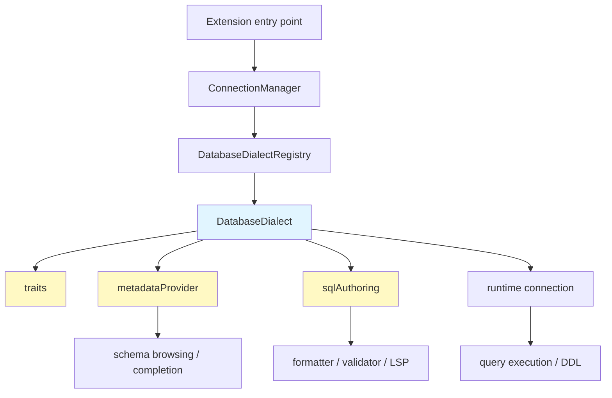

# Adding a New SQL Dialect

This repository supports two runtime models:

- built-in runtime dialects in `src/dialects/` (`netezza`, `sqlite`)
- optional runtime dialects delivered from sibling `extensions/<dialect>/` packages

The most important rule is:

> Keep portable SQL semantics in core, and keep driver/runtime specifics in the dialect runtime package.

That means traits, SQL authoring, and shared naming/qualification behavior belong in core-owned files, while connection classes, system queries, DDL generation, and extension activation stay with the runtime dialect package.

## Architecture Overview



The core extension owns portable SQL semantics and the registry/contract system. Built-in dialects also own runtime code in `src/dialects/*`, while optional dialect runtimes live in `extensions/<dialect>/src/` and register themselves through the public API.

## 1. Decide whether the dialect is built-in or optional

Use a built-in runtime dialect only when the core extension can ship the driver/runtime dependency safely.

Use an optional runtime dialect when the driver is native, large, platform-specific, or otherwise unsuitable for the core VSIX. In that case:

- core still owns the SQL semantics (`traits.ts`, `sql/authoring.ts`)
- the sibling extension owns runtime registration and driver-specific implementation

## 2. Create the core-owned dialect metadata

Create a dialect folder under `src/dialects/<dialect>/` for the parts that must be available before optional extensions activate.

Typical structure:

```text
src/dialects/<dialect>/
├── traits.ts
└── sql/
    └── authoring.ts
```

Built-in runtime dialects usually also have:

```text
src/dialects/<dialect>/
├── index.ts
├── connectionForm.ts
├── advancedFeatures.ts
├── metadata/
│   └── provider.ts
├── runtime.ts
├── traits.ts
└── sql/
    └── authoring.ts
```

## 3. Define dialect traits

Traits drive identifier formatting, qualification rules, and path completion behavior.

```ts
import { createDatabaseDialectTraits } from '../../contracts/database';

export const myDialectTraits = createDatabaseDialectTraits({
    identifiers: {
        quoteStyle: 'double',
        unquotedIdentifierPattern: /^[A-Z_][A-Z0-9_]*$/
    },
    qualification: {
        twoPartNameStyle: 'schema-object',
        twoPartContainerPreference: 'database-over-schema',
        supportsThreePartName: true,
        databaseOnlyReferenceStyle: 'double-dot'
    },
    completion: {
        singleDotPathNamespace: 'schema',
        supportsDoubleDotPath: false
    },
    objects: {
        supportsIndexes: true
    }
});
```

Current meanings:

- `identifiers.quoteStyle`: SQL identifier quoting style used by the formatter/helpers
- `identifiers.unquotedIdentifierPattern`: names that do not require quoting for that dialect
- `qualification.twoPartNameStyle`: whether `A.B` should be treated as `schema.object` or `database.object`
- `qualification.supportsThreePartName`: whether `database.schema.object` is emitted/treated as native notation
- `qualification.databaseOnlyReferenceStyle`: how `database + object` should be rendered when no schema is provided
- `completion.singleDotPathNamespace`: how `db.` / `schema.` style completion paths should be interpreted
- `completion.supportsDoubleDotPath`: whether `DB..TABLE` completion paths are valid
- `objects.supportsIndexes`: currently a capability-style flag for future shared object handling

## 4. Register the traits in the static core map

Add the new traits entry in `src/core/dialectTraits.ts`.

```ts
import { myDialectTraits } from '../dialects/myDialect/traits';

const DIALECT_TRAITS_BY_KIND = {
    // ...existing kinds
    myDialect: myDialectTraits
};
```

Also update `SUPPORTED_DATABASE_KINDS` and aliases in `src/contracts/database/index.ts` when introducing a new kind.

## 5. Add SQL authoring in core

SQL authoring is loaded eagerly from core so formatter, validator, completion, and the LSP keep working before optional extensions activate.

For every new dialect, add a core-owned authoring module:

```text
src/dialects/<dialect>/sql/authoring.ts
```

Then register it in:

- `src/core/sqlAuthoringRegistry.ts`

If the runtime dialect lives in `extensions/<dialect>`, the extension-side `*SqlAuthoring.ts` should be only a thin re-export or adapter.

## 6. Add or update the runtime dialect package

For a built-in runtime dialect, wire the runtime implementation directly in `src/dialects/<dialect>/index.ts`.

For an optional runtime dialect, add or update the sibling extension package:

```text
extensions/<dialect>/src/
├── extension.ts
├── <dialect>Dialect.ts
├── <dialect>Connection.ts
├── <dialect>SchemaProvider.ts
├── <dialect>DdlGenerator.ts
└── ...other driver-specific files
```

The runtime dialect object must include `traits` from the core-owned dialect folder:

```ts
import { myDialectTraits } from '../../../src/dialects/myDialect/traits';

export const myDialect: DatabaseDialect = {
    kind: 'myDialect',
    displayName: 'My Dialect',
    capabilities: createDatabaseCapabilities(),
    traits: myDialectTraits,
    metadataProvider: myMetadataProvider,
    sqlAuthoring: mySqlAuthoring,
    getConnectionConstructor() {
        return MyConnection as unknown as DatabaseConnectionStaticConstructor;
    },
    createConnection(config) {
        return new MyConnection(config);
    }
};
```

Register optional runtime dialects from the extension entry point through the public API.

## 7. Let registration validation protect you

Runtime dialect registration now validates trait consistency in `src/core/factories/databaseDialectRegistry.ts`.

Current validation rules include:

- `twoPartNameStyle: 'database-object'` requires `supportsThreePartName: false`
- `twoPartNameStyle: 'database-object'` requires `singleDotPathNamespace: 'database'`
- `singleDotPathNamespace: 'schema-or-database'` requires `supportsDoubleDotPath: true`
- `singleDotPathNamespace: 'schema-or-database'` is only valid for `schema-object` dialects
- `unquotedIdentifierPattern` must be a real `RegExp` and reject obviously invalid identifiers

If registration fails, fix the traits first instead of adding more special-case logic in shared callers.

## 8. Understand the dialect contract

Each dialect registration must provide a valid `DatabaseDialect` implementation with these pillars:

- `kind`, `displayName`, and `capabilities`
- `traits` for identifiers / qualification / completion semantics
- `metadataProvider` query builders that return non-empty SQL strings
- `sqlAuthoring` assets for completion, formatting, and validation
- `getConnectionConstructor()` and `createConnection(config)` for the runtime connection

The shared metadata-provider contract is defined in `src/contracts/database/metadataProvider.ts`. In practice, a dialect should always cover at least:

- `buildListDatabasesQuery()`
- `buildListSchemasQuery(database)`
- `buildListTablesQuery(database, schema)`
- `buildListViewsQuery(database, schema)`
- `buildListProceduresQuery(database, schema)`
- `buildColumnsWithKeysQuery(database, options)`
- `buildObjectSearchQuery(database, likePattern)`
- `buildViewSourceSearchQuery(database, options)`
- `buildProcedureSourceSearchQuery(database, options)`

Trait consistency is validated during runtime registration by `src/core/dialectTraitsValidator.ts`. If registration fails, fix the dialect contract first instead of adding new special-case branches in shared core code.

## 9. Add tests before wiring everything broadly

Required CI-safe coverage:

- `src/__tests__/dialectTraits.test.ts`
- `src/__tests__/optionalDialects.unit.test.ts`
- `src/__tests__/contracts/databaseDialectContract.test.ts`
- `src/__tests__/sqlAuthoringRegistry.test.ts`
- `src/__tests__/completionEngine.test.ts`

Add targeted dialect-specific tests when the dialect has special notation (for example `DB..TABLE`, `database.table`, or dialect-specific quoting behavior) or complex system-query behavior.

## 10. Prefer extending traits over adding new switches

When you need new shared behavior, prefer one of these approaches:

1. extend `DatabaseDialectTraits`
2. update the core trait map
3. teach shared helpers to consume the new trait

Avoid sprinkling new `if (databaseKind === ...)` checks through shared core code unless there is no reasonable contract shape for the behavior.

## 11. Pre-registration checklist

Before considering a dialect addition complete, verify:

### Traits

- [ ] `twoPartNameStyle` matches the database notation (`schema.object` vs `database.object`)
- [ ] `supportsThreePartName` is only enabled when the dialect truly supports `database.schema.object`
- [ ] `singleDotPathNamespace` matches the intended completion behavior
- [ ] `unquotedIdentifierPattern` matches representative unquoted identifiers for that dialect

### Metadata provider

- [ ] All required builder methods return non-empty SQL strings
- [ ] Database/schema filtering matches the dialect semantics
- [ ] System-object filtering is handled where needed

### SQL authoring

- [ ] Completion keywords are populated
- [ ] Formatter keyword sets are populated
- [ ] Validation exposes builtin functions and type metadata
- [ ] Quality rules are present when the dialect supports them

### Validation commands

```bash
npm run check-types
npm run lint
npm run build
npm run test -- --testPathIgnorePatterns="realDatabase.integration.test.ts"
```

Use targeted test runs while iterating, but finish with the full gate above.
