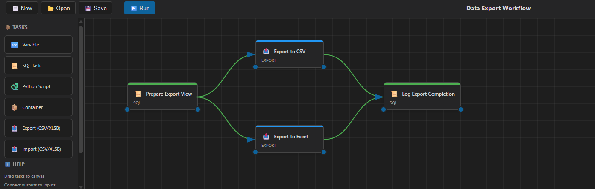

# ETL Designer

The ETL Designer provides a visual, drag-and-drop interface for creating data extraction, transformation, and loading workflows in IBM Netezza.

## Opening the ETL Designer

There are several ways to open the ETL Designer:

1. **Command Palette**: Press `Ctrl+Shift+P` → type "Netezza: Open ETL Designer"
2. **Schema Browser Toolbar**: Click the workflow icon (⚡) in the Netezza Schema view toolbar
3. **New Project**: Command Palette → "Netezza: New ETL Project"
4. **Open Existing**: Command Palette → "Netezza: Open ETL Project"

## Interface Overview



The ETL Designer interface consists of four main areas:

### 1. Toolbar (Top)
- **📄 New**: Create a new ETL project
- **📂 Open**: Load an existing `.etl.json` project file
- **💾 Save**: Save the current project
- **▶️ Run**: Execute the ETL workflow
- **⏹️ Stop**: Cancel a running execution (appears during execution)

### 2. Toolbox (Left Panel)
Drag task types onto the canvas:

| Task | Description |
|------|-------------|
| 📜 **SQL Task** | Execute SQL queries against Netezza |
| 🐍 **Python Script** | Run Python scripts (inline or from file) |
| 📦 **Container** | Group multiple tasks together |
| 📤 **Export** | Export query results to CSV or XLSB |
| 📥 **Import** | Import data from CSV/XLSB into tables |

### 3. Canvas (Center)
The main workspace where you build your workflow:
- **Drag tasks** from the toolbox to add them
- **Click a task** to select it and view properties
- **Double-click** or use "Edit Configuration" to configure a task
- **Drag from output (right connector) to input (left connector)** to create connections
- **Click a connection line** to delete it
- **Press Delete** or click the × button to remove a selected task

### 4. Properties Panel (Right)
Displays details of the selected task:
- Task ID, Name, Type, Position
- Configuration details specific to each task type
- **Edit Configuration** button for quick access

## Task Types

### SQL Task
Execute SQL queries against your connected Netezza database.

**Configuration:**
- **Query**: The SQL statement to execute
- **Connection**: Uses the active connection

**Features:**
- Supports variable substitution: `${variableName}`
- Results can be passed to downstream tasks

### Python Script
Run Python scripts for data transformation or custom logic.

**Configuration:**
- **Script Source**: Inline code or external file
- **Script Path** (if file): Path to `.py` file
- **Script** (if inline): Python code
- **Interpreter**: Python executable (auto-detected by default)

**Features:**
- Environment variables from previous tasks are available
- Can read/write files for data exchange

### Export Task
Export query results to files.

**Configuration:**
- **Format**: CSV or XLSB (Excel Binary)
- **Output Path**: Destination file path
- **Query**: SQL to generate export data

### Import Task
Import data from files into Netezza tables.

**Configuration:**
- **Input Path**: Source file (CSV, TSV, or XLSB)
- **Target Table**: Destination table name
- **Create Table**: Auto-create table if it doesn't exist
- **Format**: Auto-detected or specified

### Container Task
Group multiple tasks that should be treated as a unit.

**Configuration:**
- **Child Tasks**: Nested tasks within the container

## Connections and Execution Order

### Creating Connections
1. Hover over a task to see its connectors
2. Click and drag from the **output connector** (right side)
3. Drop on another task's **input connector** (left side)

### Deleting Connections
- **Click the connection line** (it highlights in red)
- Confirm deletion in the dialog

### Execution Rules
- **Connected tasks**: Run sequentially in dependency order
- **Unconnected tasks**: Run in parallel
- Uses **Kahn's algorithm** for topological sort to determine order

## Project Files

ETL projects are saved as `.etl.json` files containing:
- Project metadata (name, version)
- All nodes with their positions and configurations
- All connections between nodes
- Project variables

### Example Structure
```json
{
  "id": "project-123",
  "name": "Daily Data Load",
  "version": "1.0.0",
  "nodes": [...],
  "connections": [...],
  "variables": {}
}
```

## Running a Project

1. Ensure you have an **active Netezza connection**
2. Click **▶️ Run** in the toolbar
3. Monitor progress in the **ETL Execution** output channel
4. Task nodes change color to indicate status:
   - 🔵 Blue: Pending
   - 🟡 Yellow: Running
   - 🟢 Green: Success
   - 🔴 Red: Error
   - ⚫ Grey: Skipped

### Stopping Execution
- Click **⏹️ Stop** to request cancellation
- Currently running tasks will attempt to stop gracefully

## Keyboard Shortcuts

| Shortcut | Action |
|----------|--------|
| `Delete` | Delete selected task |
| `Double-click` | Configure task |
| `Right-click` | Context menu (delete) |

## Tips

1. **Plan your workflow** before building - sketch out the data flow
2. **Use meaningful names** for tasks to make the workflow readable
3. **Test incrementally** - add and test tasks one at a time
4. **Save frequently** - use `💾 Save` to preserve your work
5. **Check the output** - the ETL Execution channel shows detailed logs
