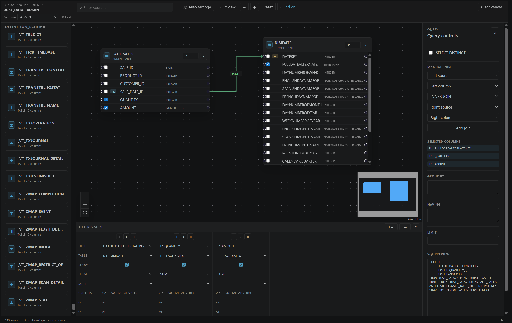

# Visual Query Builder

The Visual Query Builder creates readable SQL `SELECT` statements from tables and views without requiring you to write the initial join and projection by hand. It is available for Netezza, DuckDB, and File SQL connections.

## Open the builder

1. Connect to a supported database.
2. In the Schema Browser, right-click a **TABLE** or **VIEW** type group.
3. Select **Open Visual Query Builder**.

You can also run **JustyBase: Open Visual Query Builder** from the Command Palette.

## Build a query

1. Choose a schema in the header and select **Reload** if you need to refresh its metadata.
2. Drag a table or view from **Sources** to the canvas, or double-click it to add it automatically.
3. Select columns on each source card. Selected fields become the query projection.
4. Create joins by connecting the handles beside two columns. When relationship metadata is available, compatible joins are added automatically as sources are placed. For other joins, use **Manual join** in the query inspector.
5. Select a source or join on the canvas to edit its aliases or join type.

The canvas toolbar provides source search, automatic arrangement, fit-to-view, zoom, grid visibility, view reset, and **Clear canvas** controls. The current design is saved in the VS Code workspace state for the active connection and schema.

## Filter, sort, and aggregate

Use **Filter & Sort** below the canvas to add fields and configure the generated query:

- choose projected fields or enter an expression;
- enable or hide fields with **Show**;
- select an aggregate such as `SUM`, `COUNT`, `MIN`, `MAX`, or `AVG`;
- set ascending or descending sort order;
- enter criteria and additional `OR` rows;
- move or remove fields as the projection changes.

Double-clicking a column on a source card adds it to this grid. The query inspector also exposes `SELECT DISTINCT`, `GROUP BY`, `HAVING`, and `LIMIT` controls.

## Review and run SQL

The **SQL preview** updates as the design changes. Use its actions to:

- **Copy** the generated SQL to the clipboard;
- **Open** it in a new SQL editor;
- **Run** it by opening it in the editor and executing it.

The generated document keeps the active database connection, including for File SQL sources.

## Notes

- Tables and views are loaded from the selected connection's metadata.
- The builder preserves the design while metadata is reloaded and drops stale source references gracefully.
- A query with no explicitly selected columns falls back to the first source's columns.
- `GROUP BY` and `HAVING` values supplied by the filter grid take precedence over matching manual inspector text.
