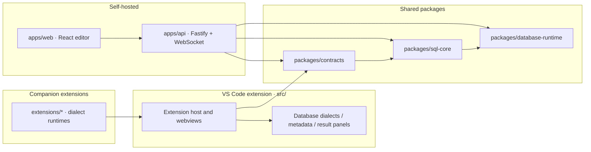

# Architecture and contracts

## Runtime layers

- `src/` is the desktop composition root and VS Code integration.
- `packages/contracts/` is the additive public type boundary.
- `packages/sql-core/` owns parser, completion, formatting, diagnostics, symbols, and rename behavior without importing `vscode`.
- `packages/database-runtime/` owns reusable execution and read-only safety helpers.
- `apps/api/` owns Fastify auth, profiles, sessions, REST, and WebSockets.
- `apps/web/` owns the React editor, Monaco client, schema tree, and result grid.
- `extensions/*/` add database-specific runtimes/providers and remain separately buildable.

## Composition and capability

`src/core/connectionFactory.ts` and database dialect contracts are the shared access path. Providers should ask the dialect for metadata, DDL, maintenance, explain, and authoring behavior instead of adding Netezza assumptions to shared code. Capability flags control menu visibility; database authorization still controls execution.

## Parser data flow

Lexer → Chevrotain parser → CST/scope helpers → semantic role map → LSP/editor providers. Keep recursive token collection for Netezza relaxed identifiers and preserve `DB..TABLE`. Semantic coloring requires a strict parse and intentionally returns no role map after actionable parse errors.

## Metadata data flow

Connection → metadata provider/cache → disk serializer/compressor → metadata bridge/LSP schema provider → completion/validation/result context. Column `dataType` must survive both extension-host and LSP paths because SQL025/SQL026 depend on it.

## Result boundaries

The desktop result panel has loaded-row, disk-backed, and database-scope filtering modes. The Web API stores query sessions in separate SQLite files and streams sequenced events over WebSocket. Keep the user-visible data boundary in contracts; never describe a local spill as a server-complete dataset.

## AI and MCP

Copilot registrations are aligned with `src/contracts/copilotTools/contracts.ts`, activation registration, and the manifest. MCP uses `src/mcp/mcpToolCatalog.ts` and a read-only gate for both stdio and HTTP. New tools must update code, contract, catalog, privacy documentation, and generated docs in the same change.
