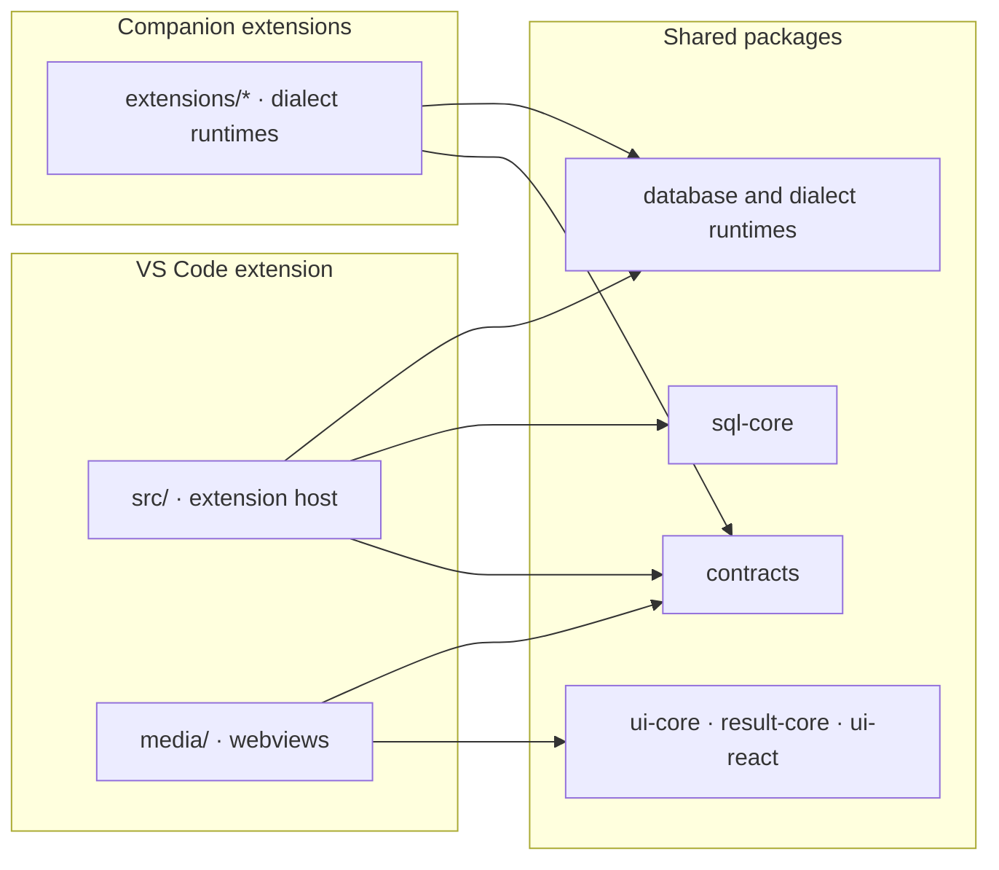

# Architecture and contracts

## Runtime layers

- `src/` is the desktop composition root and owns VS Code integration.
- `media/` owns webview presentation and VS Code messaging adapters.
- `packages/contracts/` contains public types shared by the desktop extension and companion extensions.
- `packages/sql-core/` owns parser, completion, formatting, diagnostics, symbols, and rename behavior without importing `vscode`.
- `packages/database-runtime/` and dialect runtimes own reusable execution and database-specific lifecycle behavior.
- `packages/ui-core/`, `packages/result-core/`, and `packages/ui-react/` keep portable state, result operations, and presentation components in shared packages. Desktop adapters retain host, lifecycle, storage, and transport policy.
- `extensions/*/` add database-specific runtimes/providers and remain separately buildable.

Shared packages remain separate even when VS Code is their only current product consumer. Their platform-neutral contracts and adapter boundaries keep the implementation composable and testable.

## Composition and capability

`src/core/connectionFactory.ts` and database dialect contracts are the shared access path. Providers should ask the dialect for metadata, DDL, maintenance, explain, and authoring behavior instead of adding Netezza assumptions to shared code. Capability flags control menu visibility; database authorization still controls execution.

## Parser and metadata data flow

Lexer → Chevrotain parser → CST/scope helpers → semantic role map → VS Code language providers. Keep recursive token collection for Netezza relaxed identifiers and preserve `DB..TABLE`. Semantic coloring requires a strict parse and intentionally returns no role map after actionable parse errors.

Connection → metadata provider/cache → disk serializer/compressor → LSP schema provider → completion/validation/result context. Column `dataType` must survive both extension-host and LSP paths because SQL025/SQL026 depend on it.

## Result boundaries

The desktop result panel has loaded-row, disk-backed, and database-scope filtering modes. Shared result-state and presentation packages own portable identity, filtering, aggregation, and grid behavior; VS Code adapters own storage, transport, DOM, and lifecycle. Keep the user-visible data boundary explicit; a local spill is not the same as a complete database result.

## AI and MCP

Copilot registrations are aligned with `src/contracts/copilotTools/contracts.ts`, activation registration, and the manifest. MCP uses `src/mcp/mcpToolCatalog.ts` and a read-only gate for both stdio and HTTP. New tools must update code, contract, catalog, privacy documentation, and generated docs in the same change.
